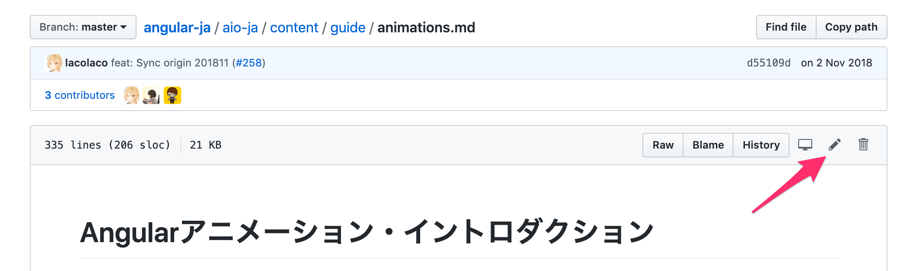

# Contribution to angular-x
// change the x to the name of your community,
please use v12.22.1 to avoid compilation issues 
## File organization

-`origin`: manage the `angular/angular` repository as a submodule
-`aio-x`: manage the translation source file `xxx.en.md`, the translation file `.md` and other files to overwrite `origin`.

### aio directory structure

Basically the Markdown files in the `content` directory are ready translation just watch out for the Dangling Links.
If necessary, edit the source code of the application as well.

https://github.com/angular/angular/tree/master/aio

```
origin/aio/
├── README.md
├── content# A document resource file written in Markdown or HTML. Mainly translate files here
│ ├── cli document resource #CLI
│ ├── examples# Source code of the sample code
│ ├── guide# Guide document resource
│ ├── images# Image in documentation
│ ├── marketing# Resources to present Angular, such as links and event information
│ ├── home# Introduction Tutorial resources
│ ├── navigation.json# Site navigation management files
│ └── tutorial# Tour de los Heroes Tutorial resources
├── application source code src# angular.io
...

```

## Translation process flow

Before you start translating, make sure no one is trying to translate the same file.
[Translation check](https://github.com/angular/angular-en/labels/type%3A%20Translation%20Checkout) If you look at the tag topic, you can see the area where we are currently working on the translation.
If you want to make a new translation, [Create issue](https://github.com/angular/angular-es/issues/new/choose) and fill in the information according to Templates.

## Minor fixes

For minor fixes to an already translated documentation, create a pull request with the `Edit` function on GitHub.


## Add translation

To translate an untranslated document again, copy the source file as `xxx.en.md` from `origin` to `aio-x` and create a translation for that source as `xxx.md`.
Submit a pull request to add the two files.

### Local preparation

#### 1. Cloning the repository

**Using ssh**
```
$ git clone git@github.com:angular-es/AngularComunities.git
```
-or-

**Using https:** 
```
$ git clone https://github.com/angular-es/AngularComunities.git

```
and  

``` 
yarn install
 ```

#### 2. Sync with source repository

This repository uses a submodule to integrate with the source repository.

use the 
```
./update-origin.sh
```

**this will clone and update the submodule and create the origin folder**

#### 3. First compilation

When the compilation is complete, the documentation site will be displayed in the `.tmp/aio/dist` directory.
You can check the created site by setting up a development server with your favorite tool.

```
$ ./build.sh

```
#### 3.2x
If you use windows use this command in powershell it can be executed from Windows server 2008 > , it has been tested on Windows 8 and 10.

```
$./build-win.ps1 or .\build.sh
```

**Note**
-If you have problems with windows, check if your system is compatible with robocopy & Get-Content.
-The construction time is very long, so please wait while you make coffee.
-On macOS, the operating system file descriptor can be used during the build process.
  In that case, you need to increase the maximum number check this:
https://github.com/meteor/meteor/issues/8057#issuecomment-261011063

```
$ echo kern.maxfiles = 65536 | sudo tee -a /etc/sysctl.conf
$ echo kern.maxfilesperproc = 65536 | sudo tee -a /etc/sysctl.conf
$ sudo sysctl -w kern.maxfiles = 65536
$ sudo sysctl -w kern.maxfilesperproc = 65536
$ ulimit -n 65536

```

#### Working with differential builds

After doing a local compilation once, you can rewrite the file directly to the `.tmp/aio` directory and work seamlessly with a differential compilation.
As long as the `yarn serve-and-sync` command is running, it can automatically rebuild when there are changes to the files in` .tmp/aio`.
However, the work in the `.tmp` directory ist managed by Git, so be sure to reflect it in the` aio-x` directory after the job.

```
$ cd .tmp/aio
$ yarn serve-and-sync
# starts the server on localhost:4200 

```

### Creating a translation request

Before you start translating, make sure no one is trying to translate the same file.
[Translation Check](https://github.com/yourname/reponame/labels/type%3A%20Translation%20Checkout) If you look at the tag topic, you can see the area where we are currently working on the translation.
If you want to make a new translation, [Create a issue](https://github.com/angular/angular/issues/new/choose) and fill in the information according to Templates.

### Create a translation pull request

Push the changes to the repository where angular/angular-x forked and send a pull request to the source of the fork.
Pull requests will be reviewed and merged if all is ok

## <a name="commit"></a> Commit Message Format

*This specification is inspired by and supersedes the [AngularJS commit message format][commit-message-format].*

We have very precise rules over how our Git commit messages must be formatted.
This format leads to **easier to read commit history**.

Each commit message consists of a **header**, a **body**, and a **footer**.


```
<header>
<BLANK LINE>
<body>
<BLANK LINE>
<footer>
```

The `header` is mandatory and must conform to the [Commit Message Header](#commit-header) format.

The `body` is mandatory for all commits except for those of type "docs".
When the body is present it must be at least 20 characters long and must conform to the [Commit Message Body](#commit-body) format.

The `footer` is optional. The [Commit Message Footer](#commit-footer) format describes what the footer is used for and the structure it must have.

Any line of the commit message cannot be longer than 100 characters.


#### <a name="commit-header"></a>Commit Message Header

```
<type>(<scope>): <short summary>
  │       │             │
  │       │             └─⫸ Summary in present tense. Not capitalized. No period at the end.
  │       │
  │       └─⫸ Commit Scope: animations|bazel|benchpress|common|compiler|compiler-cli|core|
  │                          elements|forms|http|language-service|localize|platform-browser|
  │                          platform-browser-dynamic|platform-server|router|service-worker|
  │                          upgrade|zone.js|packaging|changelog|dev-infra|docs-infra|migrations|
  │                          ngcc|ve
  │
  └─⫸ Commit Type: build|ci|docs|feat|fix|perf|refactor|test
```

The `<type>` and `<summary>` fields are mandatory, the `(<scope>)` field is optional.


##### Type

Must be one of the following:

* **build**: Changes that affect the build system or external dependencies (example scopes: gulp, broccoli, npm)
* **ci**: Changes to our CI configuration files and scripts (example scopes: Circle, BrowserStack, SauceLabs)
* **docs**: Documentation only changes
* **feat**: A new feature
* **fix**: A bug fix
* **perf**: A code change that improves performance
* **refactor**: A code change that neither fixes a bug nor adds a feature
* **test**: Adding missing tests or correcting existing tests


##### Scope
The scope should be the name of the npm package affected (as perceived by the person reading the changelog generated from commit messages).

The following is the list of supported scopes:

* `animations`
* `bazel`
* `benchpress`
* `common`
* `compiler`
* `compiler-cli`
* `core`
* `elements`
* `forms`
* `http`
* `language-service`
* `localize`
* `platform-browser`
* `platform-browser-dynamic`
* `platform-server`
* `router`
* `service-worker`
* `upgrade`
* `zone.js`

There are currently a few exceptions to the "use package name" rule:

* `packaging`: used for changes that change the npm package layout in all of our packages, e.g. public path changes, package.json changes done to all packages, d.ts file/format changes, changes to bundles, etc.

* `changelog`: used for updating the release notes in CHANGELOG.md

* `dev-infra`: used for dev-infra related changes within the directories /scripts, /tools and /dev-infra

* `docs-infra`: used for docs-app (angular.io) related changes within the /aio directory of the repo

* `migrations`: used for changes to the `ng update` migrations.

* `ngcc`: used for changes to the [Angular Compatibility Compiler](./packages/compiler-cli/ngcc/README.md)

* `ve`: used for changes specific to ViewEngine (legacy compiler/renderer).

* none/empty string: useful for `test` and `refactor` changes that are done across all packages (e.g. `test: add missing unit tests`) and for docs changes that are not related to a specific package (e.g. `docs: fix typo in tutorial`).


##### Summary

Use the summary field to provide a succinct description of the change:

* use the imperative, present tense: "change" not "changed" nor "changes"
* don't capitalize the first letter
* no dot (.) at the end


#### <a name="commit-body"></a>Commit Message Body

Just as in the summary, use the imperative, present tense: "fix" not "fixed" nor "fixes".

Explain the motivation for the change in the commit message body. This commit message should explain _why_ you are making the change.
You can include a comparison of the previous behavior with the new behavior in order to illustrate the impact of the change.


#### <a name="commit-footer"></a>Commit Message Footer

The footer can contain information about breaking changes and is also the place to reference GitHub issues, Jira tickets, and other PRs that this commit closes or is related to.

```
BREAKING CHANGE: <breaking change summary>
<BLANK LINE>
<breaking change description + migration instructions>
<BLANK LINE>
<BLANK LINE>
Fixes #<issue number>
```

Breaking Change section should start with the phrase "BREAKING CHANGE: " followed by a summary of the breaking change, a blank line, and a detailed description of the breaking change that also includes migration instructions.


### Revert commits

If the commit reverts a previous commit, it should begin with `revert: `, followed by the header of the reverted commit.

The content of the commit message body should contain:

- information about the SHA of the commit being reverted in the following format: `This reverts commit <SHA>`,
- a clear description of the reason for reverting the commit message.

## Translation guidelines

Follow the guidelines below for Your Lang translation.

### Save the source text as a `.en.md` file

To manage the difference from the original text after updating the source, save the original text at the time of translation as a `xxx.en.md` file.
For a new translation, copy the English file `xxx.md` into the file `xxx.en.md` and edit the source file of the copy `xxx.md`.

### Align line break position with original text

If possible, make sure the original and translated lines have the same number of lines, and cooperate to make it easy to check for differences when updating.

### Follow textlint

Basic unification of notation fluctuations can be automatically corrected using textlint.
If textlint find an error, it is caught in CI and the pull request cannot be merged.

### Keep original nuances

Since the documentation is a technical document, maintaining readability, keep the nuances of the original text as much as possible and keep translations to a minimum.

Until you get used to it, it is recommended to proceed by correcting specific Angular terms based on machine translations like Google Translate.

### About 'Hanging Links Found': Add Anchor

When you compile, you may get the following error:

```
warn: Dangling Links Found in "guide/deployment.json":
 -guide/browser-support#polyfills
warn: Dangling Links Found in "guide/deprecations.json":
 -guide/releases#deprecation-practices,
 -guide/component-styles#deprecated-deep - y-ng-deep
warn: Dangling Links Found in "guide/glossary.json":
 -guide/workspace-config # project-tool-configuration-options,
 -guide/workspace-config # project-tool-configuration-options
warn: Dangling Links Found in "api/common/NgForOf.json":
 -guide/template-syntax # template-reference-variables - var-
error: Error: 6 unmatched links
```

This error is a relative link in the documentation warning that the link cannot be found.
In the first example above, although the `guide/implementation` is linked to `guide/browser-support#polyfills`, the `guide/browser-support` page says `#polyfills`. Warning that the holder does not exist.

This error often occurs when you translate a header that begins with `#`.
You must add an anchor in the translation to resolve the link reference. Add a form directive `{@a xxxxxx}` to the translated header as follows.

```md

## Polyfill {@a polyfills}

```
# **Bonus** 
The most important and hard work is maintain the interest and participation of the community
You can create a GitHub [organization](https://github.com/organizations/plan)
You can use an organization app like slack , teams discord or whatever you like to keep the to maintain communication with the community, and those interested in the project.
Make a project with task and milestones like the [Angular](https://github.com/angular/angular/projects/) project to keep track of the time and effort 
